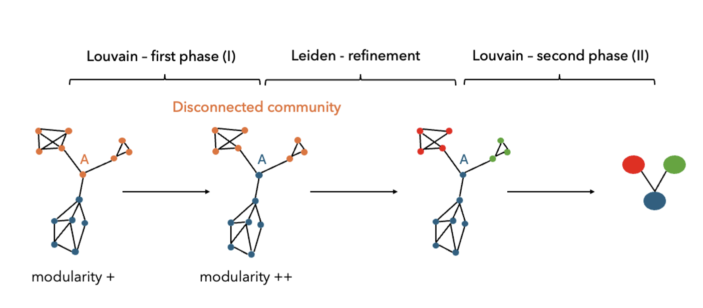

# GraphST

The GraphST tool (1) was implemeted using the [GraphST project](https://github.com/JinmiaoChenLab/GraphST). Nevertheless, in order to optimize the testing of Louvain and Leiden methods with different number of clusters, some modifications were done in `GraphST/GraphST/utils.py`. These changes avoid recalculating resolutions multiples times but determine the resolutions corresponding to a list of cluster numbers of interest. 
Different functions to visualize clustering (e.g. silhouette scores, UMAP) and automate the clustering with different methods can be found in `functions_graphST.py`.

The dependencies used are listed in the requirements.txt and can be installed using the following command:

```bash
pip install -r requirements.txt
```

## Preprocessing

GraphST generates a normalized gene expression matrix X containing the top 3,000 highly variables gene expression across the spots of interests using **Scanpy** (2) (log tranformation + normalization).
- **Note:** the Scanpy normalization divides the gene counts of each cell by the total count. Thus, it assumes that all regions have the same mRNA abundance.

Based on spatial coordinates, a neighborhood graph G is built, where the k nearest spots are linked based on Euclidean distance. 
- **Note 1**: Yahui Long et al. (1) described that the best performance was obtained with k=3. Thus, this parameter is fixed at 3 (see `constuct_interaction` and `construct_interaction_KNN` functions in `GraphST/GraphST/preprocess.py`).
- **Note 2**: In cases where more than 3 spots are equidistant from the spot of interest, the first 3 neighbors in the order of the distance matrix are selected. 

## Data augmentation

A corrupted gene expression matrix X' is generated by randomly shuffling the gene expression vectors among the spots. 

## Graph Neural Network-based encoder

Information about spots spatial locations (G) and expression profiles (X and X') is learned using a **Graph Neural Network encoder** to integrate insights about neighborhood spots. It generates latent representation matrixes Z<sub>s</sub> and Z'<sub>s</sub>, depending on the normalized matrix used in input.
On one hand, z<sub>i</sub> and z'<sub>i</sub> represent the latent representation of spot i, capturing an aggregation of neighboring spots' expression and spatial informations. On the other hand, g<sub>i</sub> represents the spatial context of i.
Thus, g<sub>i</sub> and z<sub>i</sub> are defined as positive pairs, whereas g<sub>i</sub> and z'<sub>i</sub> form negative pairs. Using a **Self-supervied Contrastive Learning (SCL)** strategy, the mutual information of positive pairs is maximized in contrary to the mutual information of negative pairs which is minimized to learn and detect spatial domains with coherent gene expression patterns. 
Finally, a spatial gene expression matrix H<sub>s</sub> is constructed from the trained model using a decoder. 

## Clustering

Three clustering methods are proposed by GraphST, namely mclust (3), louvain and leiden (4).

### mclust

mclust is a model-based clustering based on parameterized finite Gaussian mixture models.
The probability density of a spot y<sub>i</sub> is given by:

$$
p(y_i) = \sum_{g=1}^{G} \tau_g f_g(y_i | \theta_g)
$$

with G the number of clusters, τ<sub>g</sub> the mixture probability (proportion of points in cluster g) and f<sub>g</sub> the multivariate normal distribution function.  
- **Note**: θ<sub>g</sub> is composed of μ<sub>g</sub>  (mean vector) and Σ<sub>g</sub> (covariance matrix).  
These parameters are estimated by **maximum likelihood estimation (MLE)** using the **Expectation-Maximizing (EM)** algorithm, with the E step corresponding to the calculation of the probability that y<sub>i</sub> belongs to the cluster g, and the M step that updates the parameters by maximizing the ponderate likelihood function. 

### Louvain

The Louvain algorithm is a hierarchical graph-based clustering method that iteratively optimizes modularity by merging nodes. 
**Modularity** measures the clustering quality by maximizing the difference between the actual and the expected number of edges in a community. Thus, a network with high modularity is composed by communities with more edges than expected (4).  
Based on the spatial cooridnates, a neighborhood graph is generated where the nearest spots are linked. At the beginning the method considers each node as a community.
(I) The nodes for which the combination increases locally the graph modularity are grouped into communities. 
(II) Thus, nodes that belong to the same community are fusionned to create a new graph where the communities become the nodes. 
 - **Note**: During the second steps, edges and loops are ponderated based on the number of edges inter and intra communities respectively.

   
### Leiden

The Leiden algorithm was introduced to address a consistent drawback of the Louvain algorithm. Indeed, because the first phase of Louvain is based on local research of graph modularity increasing, a  community that increases the modularity can be identified initially. Nevertheless, a new community assignment that includes a node (A) from the previously identified community can be tested in a second time (see figure below). If this new community increases the modularity more largely than the first one, node (A) will be merged with the nodes from the new community, whereas the other nodes from the first communities will be grouped together.
Nevertheless, in the context where the node (A) acts as a bridge within the first community, removing it will create a badly connected community (with two isolated parts) that will be fusionned during the second step. 

The Leiden algorithm addresses this issue by adding an intermediate step of refinement between (I) the iddentification of communities that increase modularity and (II) the fusion of nodes from the same community. This refinement step consists of aggregating well connected nodes from the previously defined community, preventing the formation of disconnected communities. Thus, sub-communities can be identified from a larger initial community. Finaly, the last step is applied on these sub-communities.




## Refinement

GraphST proposes an optional method to reassign the spots to the same cluster that those of the surrounding spots within a defined radius.  

## References

1 - GraphST: Spatially informed clustering, integration, and deconvolution of spatial transcriptomics with GraphST, Nature Communication, Yahui Long et al. 2023

2 - SCANPY: large-scale single-cell gene expression data analysis, Genome Biology, F.Alexander Wolf et al. 2018

3 - mclust 5: clustering, classification and density estimation using Gaussian finite mixture models, The R Journal, Scrucca L et al. 2016

4 - From Louvain to Leiden: guaranteeing weel-connected communities, Scientific Reports, V.A.Traag et al. 2019
