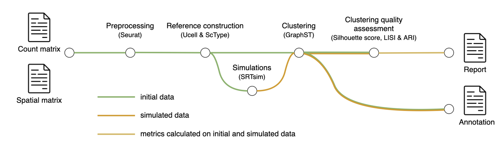

## Clustering Nextflow pipeline



### Options

```
--sample_name
--thr_min  (minimum count cutoff to filter spots)
--thr_max  (maximum count cutoff to filter spots)
--basal_thr  (basal Uscore threshold to define 'basal' spots)
--classical_thr  (classical Uscore threshold to define 'classical' spots)
--output
--seeds (seeds used to generate simulated spatial transcriptomics  data)
```
### Example

```
nextflow run filtering_clustering_pipeline.nf \
--sample_name Visium_FFPE_V43T08-051_D \
--thr_min 2500 \
--thr_max Inf \
--basal_thr 0.25 \
--classical_thr 0.25 \
--output nf_output \
--seeds 1,2
```
### Requirements

- anndata==0.8.0
- harmonypy==0.0.10
- igraph==0.11.8
- leidenalg==0.10.2
- louvain==0.8.2
- matplotlib==3.4.2
- numpy==1.22.3
- POT==0.9.5
- pandas==1.4.2
- python
- R
- rpy2==3.4.1
- scanpy=1.9.1
- scipy==1.8.1
- scikit-learn==1.1.1
- seaborn==0.13.2
- torch
- tqdm==4.64.0
